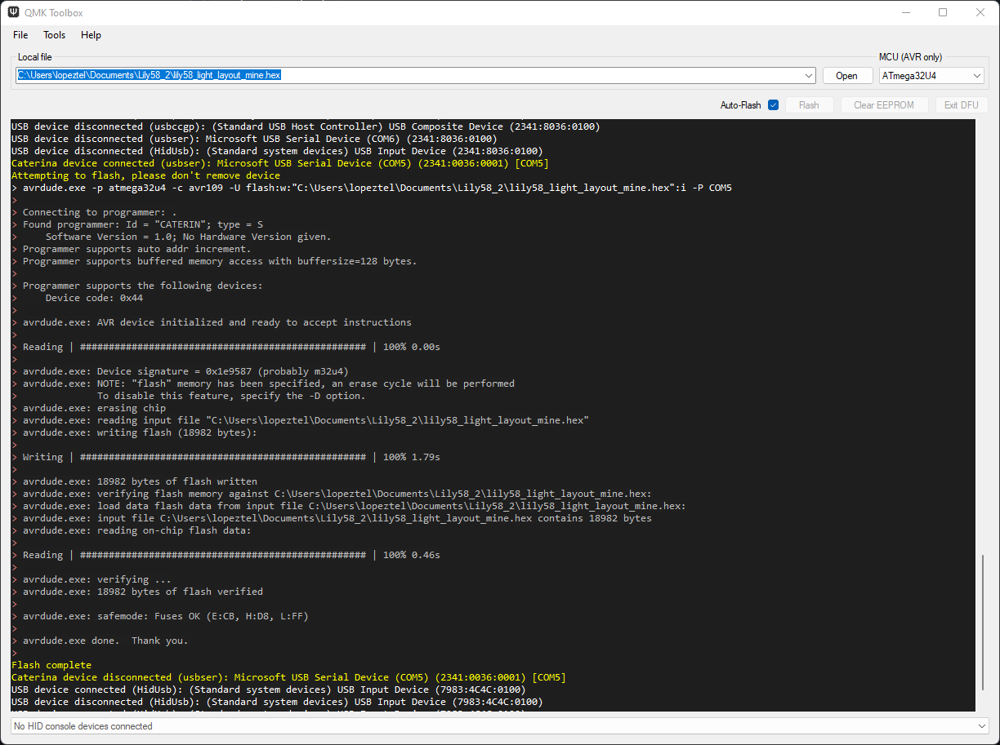
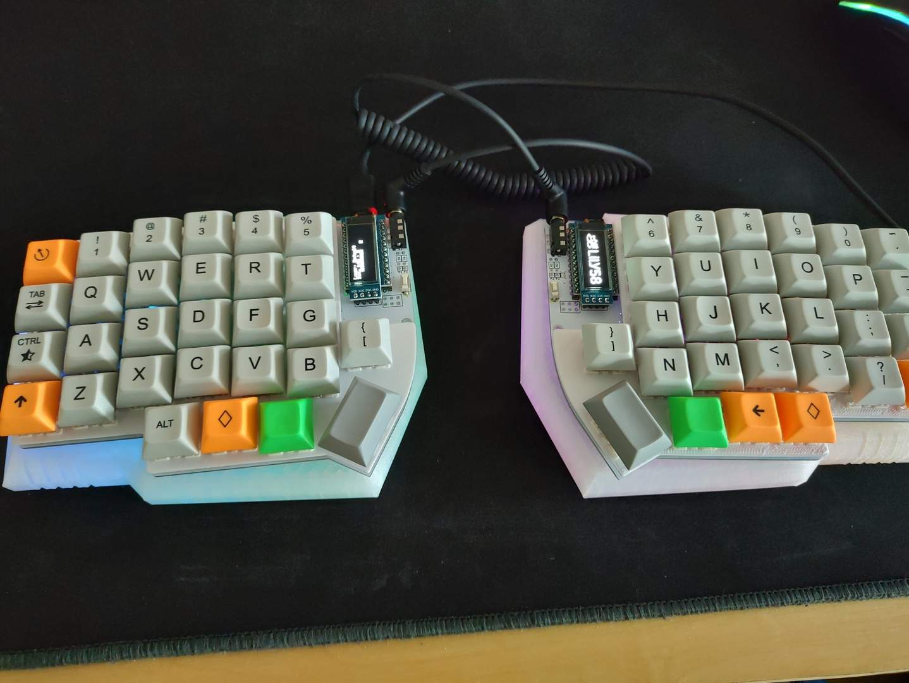

# QMK-config
My own QMK keymap config files for Lily58

You should be able to compile by copying the directory _lopeztel_ into your _qmk\_firmware/keyboards/lily58/keymaps/_ directory and then run `qmk compile -kb lily58/rev1 -km lopeztel` in either a working qmk linux install or under [QMK MSYS](https://msys.qmk.fm/)

Alternatively you could just flash my provided binary (assumes a WS2812B LED strip with 6 LEDS for underglow, OLED display enabled and an almost default keymap)

For flashing either issue the corresponding avrdude commmands under linux or use [QMK Toolbox](https://github.com/qmk/qmk_toolbox/releases)

Example:

More information at:
- [QMK building firmware](https://docs.qmk.fm/#/newbs_building_firmware)
- [QMK flashing firmware](https://docs.qmk.fm/#/newbs_flashing)
